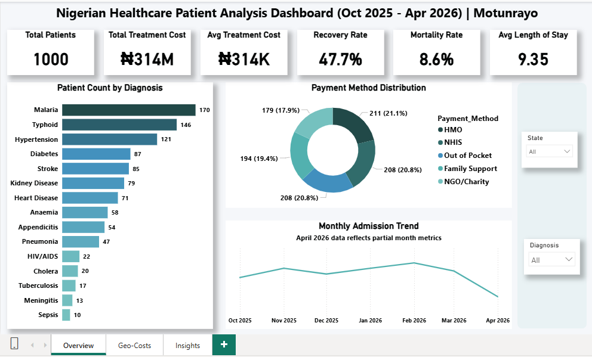
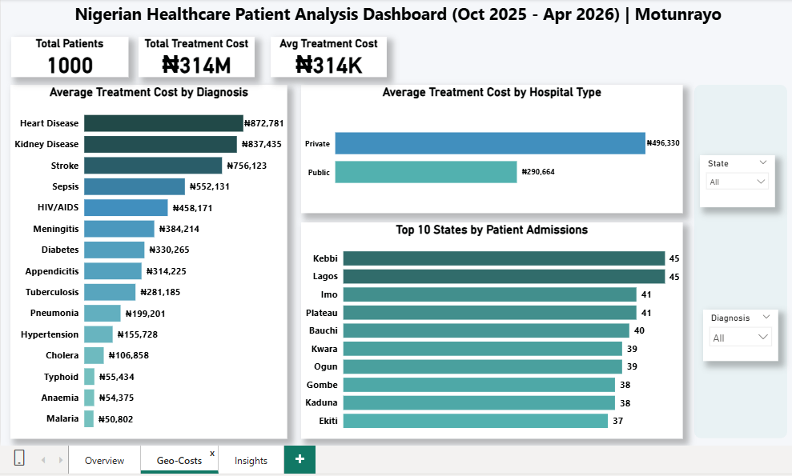
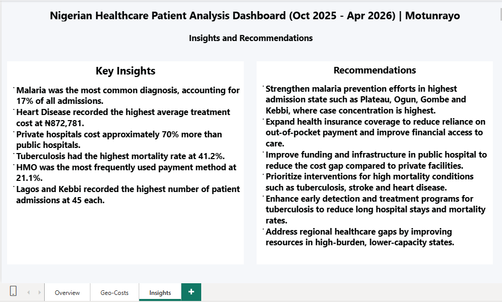

#  Hi, I'm Motunrayo Osho
## Data Analyst (Excel | SQL | Power BI)

Junior Data Analyst based in Nigeria with experience transforming raw data into actionable insights through data cleaning, analysis and visualization. Skilled in using Excel, SQL and Power BI to uncover trends, build dashboards and support data-driven decision-making.

Currently building portfolio projects in healthcare analytics while seeking remote Data Analyst opportunities.

🛠️ Technical Skills

**Excel:** Pivot Tables, XLOOKUP, Conditional Formatting, Data Visualization

**SQL:** Data Querying, Aggregate Functions, GROUP BY, CASE Statements, Data Exploration

**Power BI:** Data Modeling, DAX, KPI Development, Interactive Dashboards

**Analytics:** Data Cleaning, EDA, Data Validation, Business Insights, Reporting

## 📊 Featured Project

### 📊 Data Analysis

## 🏥 Nigerian Healthcare Patient Analysis Dashboard

### 📌 Project Overview
This project analyzes 1,000 healthcare patient records across 29 Nigerian states and Abuja (FCT) to uncover patterns in disease prevalence, treatment costs, hospital utilization, payment methods, and patient outcomes.
The project demonstrates a complete analytics workflow from data cleaning and preparation to SQL analysis and dashboard development.

### Business Objective

Healthcare providers and policymakers require data-driven insights to improve healthcare planning, resource allocation and patient outcomes.

This analysis focuses on answering key business questions:

- Which diseases are most common across Nigeria?
- Which diagnoses generate the highest treatment costs?
- How do treatment costs differ between public and private hospitals?
- Which states record the highest patient admissions?
- How are healthcare expenses funded?
- What factors are associated with poorer treatment outcomes?

### 🛠️ Tools Used
- Microsoft Excel — Data cleaning & Preparation
- SQL	— Data querying and analysis
- Power BI — Dashboard Development & Reporting

### Project Files

- [SQL Queries](healthcare_analysis.sql)
- [Dataset](Nigerian_Healthcare_Data.xlsx)
- [Power BI Dashboard](powerbi_dashboard/Nigerian_Healthcare_Dashboard.pbix)
- [View Dashboard PDF](powerbi_dashboard/Nigerian_Healthcare_Dashboard.pdf)

### 📊 Dataset Information

A synthetic healthcare dataset was used to simulate patient records across multiple regions of Nigeria.

Dataset Characteristics:
- 1,000 patient records
- 15 diagnosis categories
- 30 Nigerian states
- October 2025 – April 2026
- Patient demographics
- Diagnosis information
- Treatment costs
- Hospital type
- Payment method
- Length of stay
- Treatment outcomes

Note: A synthetic dataset was used to simulate healthcare records across Nigeria due to privacy restrictions on real patient data.

🧹 Data Preparation (Excel)

Data Cleaning Tasks
- Checked for missing values — Result: 0 missing values found
- Removed duplicate records — Result: 0 duplicates found
- Checked for blank cells — Result: 0 blank cells found
- Standardized date formats
- Validated treatment cost values
- Created summary pivot tables
- Structured data for SQL analysis and Power BI reporting

## 🗄️ SQL Analysis

SQL Techniques Used

- Aggregate functions for cost and mortality analysis
- GROUP BY for diagnosis, region, and hospital segmentation
- CASE statements for patient age grouping and outcome categorization
- Date functions for trend-based analysis across months
- ORDER BY for ranking diseases, cost drivers and high-admission regions

Example Query

Disease Distribution

SELECT 
    Diagnosis, 
    COUNT(*) AS Total_Patients, 
    ROUND(COUNT(*) * 100.0 / (SELECT COUNT(*) FROM patients), 1) AS percentage 
FROM patients 
GROUP BY Diagnosis 
ORDER BY Total_Patients DESC;

Age Group Analysis

SELECT 
    CASE 
        WHEN age BETWEEN 18 AND 30 THEN '18-30 Young Adults'
        WHEN age BETWEEN 31 AND 45 THEN '31-45 Middle Aged'
        WHEN age BETWEEN 46 AND 60 THEN '46-60 Older Adults'
        WHEN age BETWEEN 61 AND 75 THEN '61-75 Elderly'
    END AS Age_Group,
    COUNT(*) AS Total_Patients,
    ROUND(AVG(Treatment_Cost_NGN), 0) AS Avg_Cost_NGN
FROM patients
GROUP BY Age_Group
ORDER BY Total_Patients DESC;

Mortality Analysis

SELECT 
    Diagnosis,
    COUNT(*) AS Total_Patients,
    SUM(CASE 
        WHEN Treatment_Outcome = 'Deceased' THEN 1 
        ELSE 0 
    END) AS Total_Deaths,
    ROUND(
        SUM(CASE 
            WHEN Treatment_Outcome = 'Deceased' THEN 1 
            ELSE 0 
        END) * 100.0 / COUNT(*), 1
    ) AS Mortality_Rate_Percent
FROM patients
GROUP BY Diagnosis
ORDER BY Mortality_Rate_Percent DESC;

## SQL Queries (Evidence)

Full query screenshots:
[View SQL Query Screenshots](images)

## 🗄️ SQL Findings

### Disease Trends
- Malaria accounted for 17% of all admissions, making it the most common diagnosis.
- Malaria, Typhoid and Hypertension represented over 43% of total cases.

### Treatment Costs
- Heart Disease recorded the highest average treatment cost (₦872,781).
- Private hospitals were approximately 70% more expensive than public hospitals.

### Patient Outcomes
- Overall recovery rate was 47.7%.
- Tuberculosis recorded the highest mortality rate (41.2%).
- Chronic diseases were associated with longer hospital stays and poorer outcomes.

### Demographics & Geography
- Patients aged 46–60 represented the largest admission group.
- Lagos and Kebbi recorded the highest patient admissions.
- Southern states generally reported higher treatment costs than northern states.

## 📊 Power BI Dashboard

The cleaned dataset was imported into Power BI to create an interactive dashboard for monitoring healthcare trends across Nigeria.

### Dashboard KPIs
- Total Patients
- Total Treatment Cost
- Average Treatment Cost
- Recovery Rate
- Mortality Rate
- Average Length of Stay

### Dashboard Visualizations
- Patient Count by Diagnosis
- Average Treatment Cost by Diagnosis
- Top 10 States by Admissions
- Monthly Admission Trends
- Payment Method Distribution
- Average Treatment Cost by Hospital Type

### Interactive Features
- State Filtering
- Diagnosis Filtering
- Cross-Filtering Across Visuals

## Dashboard Preview

### Page 1 — Overview

Shows overall patient volume, admission trends, and payment method distribution in the Nigerian healthcare system from October 2025 to April 2026. This helps identify demand patterns and funding behavior across the system.

### Page 2 — Geo-Costs

Shows treatment cost differences across diagnoses, hospital types, and states, including top admission states. Helps identify spending concentration and regional variation.

### Page 3 — Insights & Recommendations

Summarizes key insights from the analysis and provides recommendations for healthcare planning.

## 💡 Key Insights

- Infectious diseases especially malaria, dominate hospital admissions, indicating a sustained public health burden.
- Treatment cost varies significantly across hospital types, with private facilities consistently more expensive.
- Tuberculosis shows disproportionately high mortality compared to other conditions, making it a key risk area.
- Middle-aged patients (46–60) represent the highest utilization group, suggesting higher healthcare demand in this segment.
- Regional differences exist in healthcare cost and utilization, with southern states showing higher treatment costs than northern regions.

## 📋 Recommendations

- Strengthen malaria prevention programs, especially in high-admission states. 
- Expand access to health insurance schemes to reduce out-of-pocket payments.  
- Improve funding and infrastructure in public hospitals to reduce the cost gap with private facilities.  
- Focus healthcare interventions on chronic diseases such as heart disease, stroke, and kidney disease due to their high mortality rates  
- Increase early diagnosis and treatment programs for tuberculosis to reduce long hospital stays and mortality rates.  
- Address regional healthcare disparities by improving facilities in high-burden but lower-resource states.  
- Promote preventive healthcare to reduce long-term treatment costs and hospital admissions.  

## 📬 Contact Me

I am open to remote Data Analyst opportunities and collaborations.
 
- 📧 Email: oshomotunrayo647@gmail.com
- 📍 Location: Nigeria 
- 🌍 Availability: Open to Remote Opportunities Worldwide
- 🐙 GitHub: github.com/Motunrayo25

